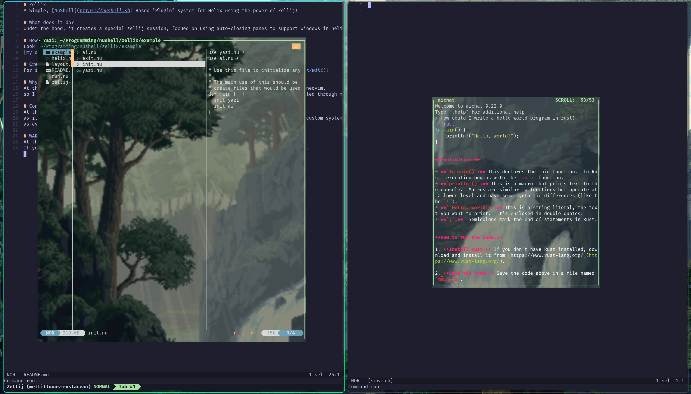

# Zellix
A Simple, [NuShell](https://nushell.sh) Based "Plugin" system for Helix using the power of Zellij!


# What does it do?
Under the hood, it creates a special zellij session, focued on using auto-closing panes to support windows in helix.

# Usage
In order to actually run the system, you must run the shell file with the following parameters.
`module`: The location of the actual module path, this is just a folder, which will be added to the environment to support using any module folder.
`path`: An *optional* path for helix to open into. This is the same as typing `hx {file}`

A simple example run, if currently inside of the cloned repository, you can run the program like this `nu ./run.nu example/`. This will run the code with the example folder as the module.

If you just want to try out zellix, clone the repository, ensure you have `zellij` and `helix` installed.
Then, if you want to try out my configuration, you will need at least one of either `yazi` or `aichat`.
You'll want to edit your helix configuration to use the following in a keybind, or you can run it in helix by pasting it.
`:sh zellij run -c -f -x 10% -y 10% --width 80% --height 80% -- nu $ZELLIX_MOD/yazi.nu` Will run the yazi program, and replacing `yazi.nu` with `ai.nu`
will run the AI Moudle.

if you want to try how i use it, the following will add keybinds for both yazi and the ai module.
```toml
[keys.normal.space.f]
f = "file_picker"
t = ":sh zellij run -c -f -x 10% -y 10% --width 80% --height 80% -- nu $ZELLIX_MOD/yazi.nu"

[keys.normal.space.l]
a = ":sh zellij run -c -f -x 10% -y 10% --width 80% --height 80% -- nu $ZELLIX_MOD/ai.nu"
```

## Example Configuration
Personally, I use nix with this, but the configuration is still very simple.
Look at the [example](example), which I use for my daily driver with helix using 
[my dotfile configuration](https://github.com/TheEmeraldBee/PixelNix) with nixos and nix-darwin!

# Creating Plugins
For information on how to create plugins, check out the [wiki](https://github.com/TheEmeraldBee/zellix/wiki)!

# Why does this exist?
At the time of writing this, there is no plugin system for helix, and I dislike the configuration of neovim,
so I created this to satiate my desire for more than just an editor systems that can still be controlled through my editor.

# Contributing
At this time, the [example](example) directory is not accepting pull requests,
as it is my personal usage of this system. But the core itself is welcome to changes to support more custom systems, as well
as eventually gaining some form of library to better support easier creation of plugins!

# WARNING
At this time, this is a very rough implementation that hasn't been fully tested. 
If you choose to use this, please report **any** bugs you find during usage, and I will fix them ASAP.
